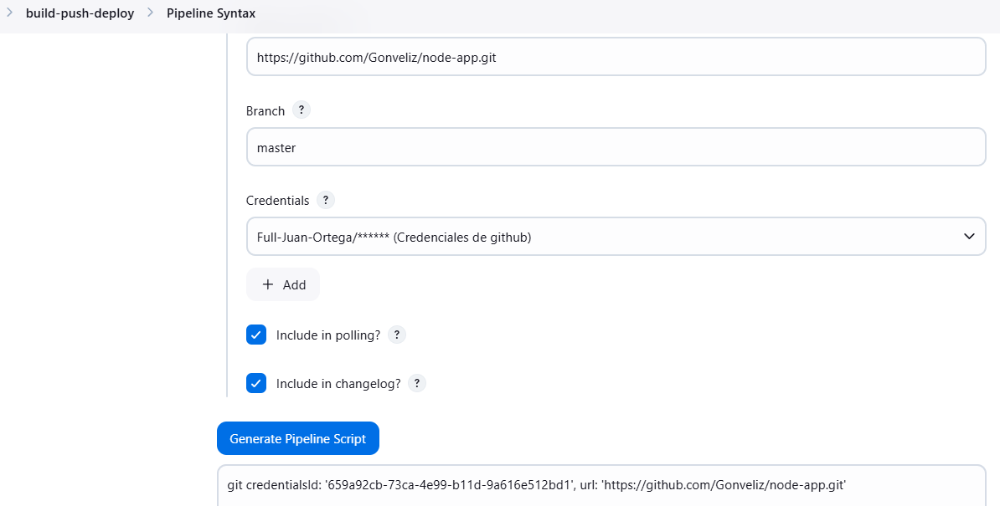
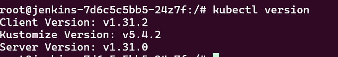
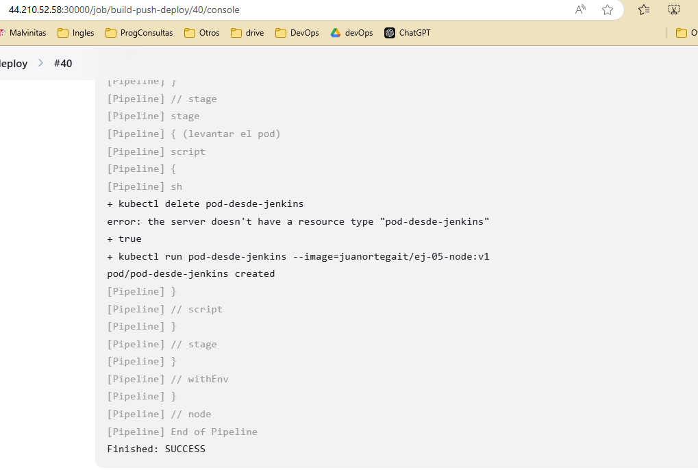

## Caso 5 - Desarrollo de pipeline para el buildeo y despliegue de servicio en el Cluster
Necesitamos un pipeline de Jenkins que buildee y suba a un registry la imagen de docker anteriormente abordada(Caso 1). Luego del buildeo, necesitamos que el servicio se despliegue en el minikube(Caso 3).  
[Repo Imagen caso 1](https://github.com/Gonveliz/node-app/blob/master/Dockerfile)

## Video de la resolucion : 

**Video :**
[](https://www.loom.com/share/c6d096241c734a60867ed775765e542a?sid=0f5c9dc4-8e5b-46e5-87ae-dff192e2d81b)

## Como desplegar

Clonamos el repositorio, levantamos minikube y todos los archivos de k8 , luego hacemos un portforward para poder acceder a jenkins desde el navegador.  

```bash
git clone https://github.com/Full-Juan-Ortega/challangue-ejercicio-5
minikube start
cd challangue-ejercicio-5/kubernetes
kubectl apply -f .
kubectl port-forward svc/jenkins 30000:30000 --address 0.0.0.0 &
```


## Analisis y resumen :

Dentro del pod del jenkins que armamos en el caso 3 necesitaria poder acceder a github(clone del repo) , docker(build), dockerhub(push) ,  kubectl para poder hacer el despliegue del pod en minikube.

**Github**

* [Configure las credenciales de github para poder hacer git clone (dado que es un repositorio privado). ](#git-push)

**Docker**

* [Instale docker en el pod de jenkins.](#docker-en-el-pod)
* Configure las credenciales de dockerhub para hacer push de la imagen.  
* En el deployment modifique el yaml para poder acceder al socket del daemon de docker del host. 

**Kubectl**

* [Agregue kubectl a la imagen.](#kubectl-en-el-pod)
* Agregue el montaje del archivo de configuracion de acceso al cluster.
* Otorgue nuevos permisos al pod para que pueda usar los verbos "create", "delete", "list" sobre el cluster.


## Proceso

### Git push

Para poder hacer el push tuve que primero cargar las credenciales en jenkins ya que es un repositorio privado.


Tenia algunas dudas de sintaxis de groovy y use el code pipeline generator de jenkins (utiliza el comando git del plugin que jenkins instala por defecto) :




### Docker en el pod.

* Probe la instalacion de docker en el pod de jenkins siguiendo los pasos de la documentacion oficial y me daba error. Termine utilizando docker.io.

* Modifique el deployment de jenkins para que monte el socket del daemon del host.


* Para dockerhub configure las credenciales y despues vi varios metodos para hacer el login en base a la [documentacion oficial de jenkins.](https://www.jenkins.io/doc/book/pipeline/jenkinsfile/#handling-credentials)  

* A pesar de ser exitoso el login y haber seguido la doc oficial no pude sacar este warning : 


### Kubectl en el pod.

1) Agregue la instalacion de kubectl a la imagen siguiendo[documentacion oficial de kubectl.](https://kubernetes.io/docs/tasks/tools/install-kubectl-linux/)



2) Agregue el montaje del archivo de configuracion de acceso al cluster : 


Monte el directorio usuario/.kube necesario para la autenticacion de kubectl en el cluster.

3) Otorgue nuevos permisos al pod para que pueda usar los verbos "create", "delete", "list" sobre el cluster.

Cree en el archivo jenkins-role.yaml donde esta el ROLE y el ROLE-BINDING para otorgar los permisos al account service "default".  
Averigue en la documentacion oficial [Control de acceso basado en roles](https://kubernetes.io/docs/reference/access-authn-authz/rbac/).  

Profundizando un poco mas en [account service](https://kubernetes.io/docs/concepts/security/service-accounts/) entendi lo siguiente :  
Al crear un pod sin especificar el account service se le asigna el "default" , el account service nos validara nuestra identidad y nos otorgara los permisos que especificamos detallamos ROLE.  

**Finalmente pod levantado exitosamente!**    



