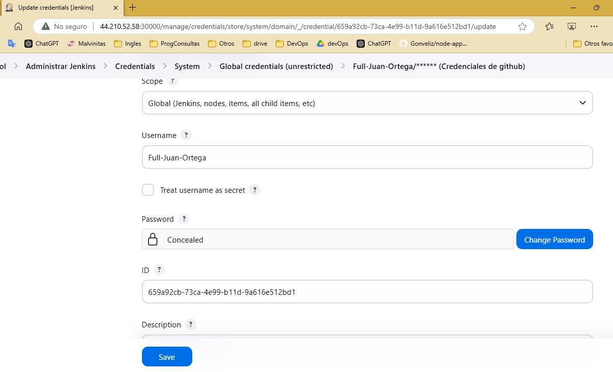
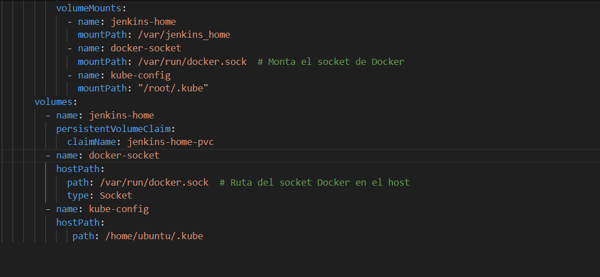
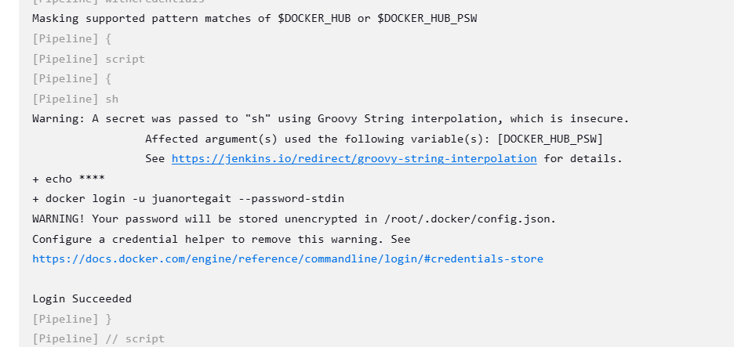

# Caso 5 - Desarrollo de pipeline para el buildeo y despliegue de servicio en el Cluster
Necesitamos un pipeline de Jenkins que buildee y suba a un registry la imagen de docker anteriormente abordada(Caso 1). Luego del buildeo, necesitamos que el servicio se despliegue en el minikube(Caso 3).  
[Repo Imagen caso 1](https://github.com/Gonveliz/node-app/blob/master/Dockerfile)

## Como desplegar

Seccion por hacer

## Analisis resumido y depurado

Dentro el pod de jenkins que armamos en el caso 3 necesitaria poder acceder a docker(build), dockerhub(push) , github y kubectl para poder hacer el despliegue del pod en minikube

**Github**

[Configure las credenciales de github para poder hacer git clone (dado que es un repositorio privado). ](#git-push)

**Docker**

* Instalacion de docker en el pod de jenkins.
* Configure las credenciales de dockerhub para hacer push de la imagen.  
* En el deployment modifique el yaml para poder accededer al socket del daemon de docker en el host. 

**Kubectl**

* Configure el entorno de minikube para poder hacer el despliegue del pod.  
* Monte el volumen que refiere a las config de kubectl.
* Configure el entorno de minikube que el pod tenga permisos para usar comandos kubectl.

## Proceso

### Git push

Para poder hacer el push tuve que primero cargar las credenciales en jenkins ya que es un repositorio privado.

Tenia algunas dudas de sintaxis de groovy y use el code pipeline generator de jenkins (utiliza el comando git del plugin que jenkins instala por defecto) :

### Docker

* Probe la instalacion de docker en el pod de jenkins siguiendo los pasos de la documentacion oficial y me daba error. Termine utilizando docker.io.

* Modifique el deployment de jenkins para que monte el socket del daemon del host.

* Para dockerhub configure las credenciales y despues vi varios metodos para hacer el login en base a la [documentacion oficial de jenkins.](https://www.jenkins.io/doc/book/pipeline/jenkinsfile/#handling-credentials)  

* A pesar de ser exitoso el login y haber seguido la doc oficial no pude sacar este warning : 

### Kubectl

